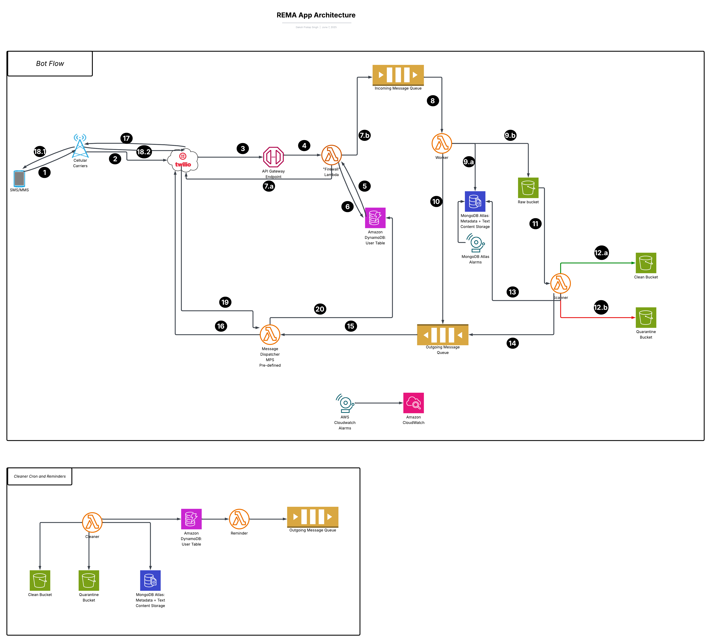

# Nalukataq

## Architecture and Message Flow

This document outlines the architecture and operational flow of the REMA messaging bot, detailing how user interactions are processed from message receipt to reply delivery, following the numbered steps in the provided architecture diagram.

- Link to [Lucid Chart](https://lucid.app/lucidchart/19a2e694-94d3-413a-99d1-5037f1897103/edit?viewport_loc=-1878%2C-876%2C3326%2C1948%2C0_0&invitationId=inv_b8e0add7-bfe7-46a1-9808-01649569c164) version.

### Main Bot Flow (Steps 1-20 from Diagram)

1. **User Sends Message:**
    * A user sends an image or text message (SMS/MMS) from their device (1) to the designated Twilio number.
2. **Carrier Transmits to Twilio:**
    * The user's mobile carrier network transmits the message, which is received by Twilio (2).
3. **Twilio Webhook to API Gateway:**
    * Twilio forwards the incoming message as an HTTP POST request to a pre-configured AWS API Gateway endpoint (3). This endpoint serves as the secure entry point to the application's backend.
4. **API Gateway Triggers "Firewall" Lambda:**
    * The API Gateway (3) immediately invokes the "Firewall" Lambda function (4). This lightweight function acts as the first line of processing and defense.
5. **Firewall Lambda: Initial Processing & Checks (Corresponds to actions by Firewall Lambda (4) interacting with DynamoDB User Table)**
    * The Firewall Lambda (4) performs several critical tasks:
    * **Twilio Signature Verification:** Cryptographically verifies the signature of the incoming request to ensure it originated from Twilio.
    * **User Validation & DynamoDB Interaction:** Queries the **DynamoDB "User" table** (icon shown connected to Firewall Lambda) to:
    * Check if the user exists.
    * Retrieve user details.
    * Update user information such as subscription status and rate limit counters. Geolocation data may also be updated if needed.
    * **Text Content Scanning:** Scans the text content of the message for any malicious patterns or keywords.
    * **Rate Limit Enforcement:** Checks if the user has exceeded their message rate limits (details in "Rate Limiting Logic" section below).
6. **Firewall Lambda: Control Command Handling & Message Routing**
    * **(Implicit path from Firewall Lambda for synchronous replies \- aligns with original text 7.a):**
    * Handles control commands like START, STOP, or DELETE synchronously.
    * Responds instantly with appropriate TwiML (Twilio Markup Language) for these commands.
    * If malicious content is detected or rate limits are exceeded, it blocks the message and may send a warning reply via TwiML.
* **(7.b in diagram) For Normal Content, Enqueue to Incoming SQS:** If the message is legitimate, not a control command, and passes all checks, the Firewall Lambda (4) drops a message onto the **Incoming FIFO SQS (Simple Queue Service) queue (7.b)**.
    * **Why FIFO?** This ensures messages from a specific user are processed in the order they are received, maintaining conversation context.
7. **Worker Lambdas Process Messages (8)**
    * Multiple "Worker" Lambda functions (8) concurrently pull messages from the Incoming FIFO SQS queue (7.b). This distributed approach allows for scalable message handling.
8. **Worker Lambda: Core Logic & Data Handling (Involves 9.a and 9.b)**
    * For each message, a Worker Lambda (8) performs the following:
    * **(Interaction with 9.b) Media Handling:** If an image/audio is attached, it downloads the media and stores it in the **S3 "Raw Media Storage" bucket (9.b)**.
    * **(Interaction with 9.a) Data Logging:** Writes the text content of the message, along with metadata (including a reference to the S3 location of any media), into **MongoDB Atlas, the "Data Store \- Text & Metadata" (9.a)**. MongoDB is used for its flexible schema and rich querying capabilities.
    * **Bot Logic Execution:** Determines the appropriate response the bot should say based on the message content and conversation history.
9. **Worker Lambda Enqueues Reply (10)**
    * The Worker Lambda (8) places the generated reply message onto the **Outgoing FIFO SQS queue (10)**.
    * **Why FIFO?** Ensures replies are sent in the order generated, crucial for conversational integrity and paced delivery.
10. **File Upload to Raw Bucket Triggers Scanner (Interaction between 9.b and 11\)**
    * When a file is uploaded by the Worker Lambda to the **S3 "Raw Media Storage" bucket (9.b)**, this event triggers the **Scanner Lambda (11)**.
11. **Scanner Lambda: Media File Scanning & Disposition (12.a, 12.b)**
    * The Scanner Lambda (11) scans the newly uploaded file from the raw bucket for viruses or other malicious content.
    * **(12.a) Clean File:** If the file is clean, it's moved to the **S3 "Clean Media Bucket" (12.a)**.
    * **(12.b) Infected/Quarantined File:** If the file is malicious or suspicious, it's moved to the **S3 "Quarantine Bucket" (12.b)**. (Manual checks are needed for this bucket).
12. **Scanner Lambda Updates Metadata in MongoDB (13)**
    * The Scanner Lambda (11) updates the metadata record for the image/file in **MongoDB Atlas (9.a via path labeled 13\)** with the scan status (e.g., "clean," "quarantined") and its final storage location (Clean or Quarantine bucket).
13. **Scanner Lambda Enqueues User Notification (14)**
    * If necessary (e.g., file was quarantined), the Scanner Lambda (11) enqueues an appropriate notification message for the user onto the **Outgoing FIFO SQS queue (10 via path labeled 14\)**. This message might inform the user about the problematic file and suggest resubmission.
14. **Dispatcher Lambda Pulls from Outgoing Queue (15)**
    * The "Dispatcher" Lambda function (15) polls the Outgoing FIFO SQS queue (10), retrieving messages to be sent. This Lambda typically has controlled concurrency to manage the outgoing message rate.
15. **Dispatcher Sends Message via Twilio (16)**
    * The Dispatcher Lambda (15) makes a REST API call to **Twilio (via path labeled 16\)** to send the message (either a bot reply or a scanner notification). It adheres to a fixed Messages Per Second (MPS) rate.
16. **Twilio Delivers the Reply (17)**
    * **Twilio (17)** queues the SMS/MMS and hands it off to the respective carrier networks for delivery to the user's device.
17. **Message Delivery and Acknowledgment (18.1, 18.2)**
    * **(18.1) Carrier Transmits to User:** The carrier network delivers the message to the **user's device (18.1)**.
    * **(18.2) Carrier Sends Acknowledgement to Twilio:** The user's carrier sends a delivery acknowledgment (ACK) or status update back to **Twilio (18.2)**.
18. **Dispatcher Receives Delivery Acknowledgment (19)**
    * Twilio forwards this delivery status update (e.g., "delivered," "failed") to the **Dispatcher Lambda (15 via path labeled 19\)**, typically through a status callback webhook.
19. **Dispatcher Closes Request/Response Loop (20)**
    * Upon receiving successful delivery confirmation from Twilio (19), the **Dispatcher Lambda (15)** closes the request/response loop for that specific interaction (action labeled 20). This signifies the end of that message cycle and allows users to send new messages without out-of-order conflicts for the completed interaction. This does not apply to system-initiated messages like reminders.

### **Additional System Components & Logic**

#### **Rate Limiting Logic**

To prevent abuse and ensure fair usage:

* **Counter:** A rateLimitCounter is maintained per phone number in the DynamoDB "User" table.
* **Increment:** Incremented for every inbound message by the Firewall Lambda.
* **TTL (Time-To-Live):** 60-minute TTL. If a user sends no messages for 60 minutes, their counter expires.
* **Threshold:** If the rateLimitCounter exceeds N (e.g., 30 messages/60 min), the Firewall Lambda replies "slow down" via TwiML and drops the message.

#### **Automated Cron Jobs & Reminder System**

* **Cleaner Crons (User Data Deletion):**
* **Schedule:** Runs daily at 12:00 AM UTC.
* **Process:**
    1. An AWS EventBridge Scheduler triggers a Lambda function.
    2. This Lambda queries the DynamoDB "User" table (and potentially S3 for opt-out requests or logs) for users who have opted out and requested data deletion.
    3. The Lambda proceeds to remove their data from DynamoDB, MongoDB Atlas, and associated S3 files, adhering to data retention policies.
        * **Diagram Reference:** The smaller diagram shows S3, EventBridge, DynamoDB, a Lambda, and an SQS queue, which could represent parts of this cleanup or a related scheduled task.
        * **Reminder System:**
        * **Trigger:** If a user needs a follow-up or forgets to continue a prompt, a DynamoDB Stream on the "User" table (or a dedicated reminders table) can trigger an AWS EventBridge scheduled event.
        * **Action:** EventBridge adds a reminder message directly to the **Outgoing FIFO SQS queue (10)**.
        * **Dispatch:** The Dispatcher Lambda (15) picks up and sends this reminder.
        * **Loop Status:** The Dispatcher **does not** close the request/response loop (20) for these system-initiated reminder messages.

#### **Data Storage Strategy**

* **DynamoDB ("User" Table):** For fast, key-value lookups: user profiles, subscription flags, rate-limit counters. Essential for the Firewall Lambda's synchronous checks.
* **MongoDB Atlas ("Data Store \- Text & Metadata" \- 9.a):** Flexible document store for message content, conversation history, and media metadata (including scan status and S3 locations). Enables rich querying.
* **Amazon S3 (9.b "Raw Media Storage", 12.a "Clean Media Bucket", 12.b "Quarantine Bucket"):** Durable, scalable, and cost-effective storage for media files (images, audio), organized into raw, clean, and quarantine buckets based on scan results.

#### **Key Considerations and Notes**

* **MMS Internet Requirement:** Users need an active internet/data connection for MMS.
* **SMS MPS:** Toll-free numbers have MPS limits (e.g., 3 MPS, increasable via Twilio). The Dispatcher (15) respects these.
* **Latency Message:** An initial message will inform users about potential response latency.
* **Dead Letter Queues (DLQs):** All SQS queues (7.b, 10\) should have DLQs to capture and isolate messages that fail processing repeatedly, allowing for debugging without blocking the queues.

#### **Monitoring and Alerts**

* **AWS CloudWatch:** Tracks Lambda errors, SQS queue depths, API Gateway metrics, and cost alarms.
* **MongoDB Atlas Alerts:** Monitors database performance (disk usage, slow queries, connections).
* **Notifications:** Alerts notify the team of deviations from normal operational parameters.

## Twilio

Our *Nalukataq* application uses [Twilio](https://twilio.com) to create reliable sending and receiving of SMS/MMS messages.

### Nalukataq's Twilio Config &amp; Important Details

- **Brand**: Charity NPO via Aqqaluk Trust
- **A2P Messaging Plan**: Standard.
  - T-Mobile daily limits: 200,000
  - Trust Score: 75/100
  - Customer type: Nonprofit
- **Charity Campaign Message throughputs**:
  - AT&T: 40 MPS (message per second)
  - T-Mobile: 2k-200k daily caps, but depends on our brand Trust Score
- **Charity Pricing Fees**:
  - Campaign Registration Fees: $3/month
  - AT&T SMS Carrier Fees (Outbound): $0.00
  - AT&T MMS Carrier Fees (Outbound): $0.00
  - T-Mobile SMS Carrier Fees (In/Outbound): $0.00
  - T-Mobile MMS Carrier Fees (In/Outbound): $0.00
- **Messaging service**: nalukataq

### Why use Twilio?

- Useful APIs (Application Programming Interfaces) that makes developing and maintaining the application much easier.
- Work as a laison between us and mobile service carriers by creating a trust profile to avoid carriers' flagging and blocking of our text messages.

### Twilio terms &amp; acronyms

- **A2P**: Application-to-Person. When a software *application* sends SMS/MMS messages to *people*.
- **Twilio *Brand***: Twilio requires you to create a brand that represents you/your organization. They use th
- **Twilio *Campaign***: Twilio requires you to create campaigns that represent each of your use cases for their services.
- **10 DLC**: Ten-*D*igit *L*ong *C*ode numbers, .e.g, +1-800-555-5555
- Customer Profile: In addition to your brand, you can create a customer profile under Twilio's Trust Hub

### Twilio Setup Procedure

#### 1. Create &amp; verify a Twilio brand

- See Twilio Help: [Programmable Messaging and A2P 10DLC](https://www.twilio.com/docs/messaging/compliance/a2p-10dlc)

Twilio requires you to create and verify a brand that represents you/your organization. They use your brand profile to develop trust scores to relay to mobile carriers. This profile can help the application communicate to carriers that any message sent to us and received by us is legit and not spam. In our case, we are working with the 501(c)3, Aqqaluk Trust, so we also will receive the following advantages:

1. Discounts per SMS/MMS sent and received
2. Discounts per campaign
3. Higher message throughputs

Verification is required before sending/receiving SMS/MMS, and it ensures compliance with mobile carrier network regulations.

##### Twilio Brand-Types &amp; Constraints

<table data-paste-element="TABLE" data-paste-core-version="21.0.1" class="css-1yrg7uf"><thead data-paste-element="THEAD" data-paste-core-version="21.0.1" class="css-c08gur"><tr data-paste-element="TR" data-paste-core-version="21.0.1" class="css-1e22c8r"><th data-paste-element="TH" data-paste-core-version="21.0.1" class="css-kczchh"></th><th data-paste-element="TH" data-paste-core-version="21.0.1" class="css-kczchh"><strong>Sole Proprietor Brand</strong></th><th data-paste-element="TH" data-paste-core-version="21.0.1" class="css-kczchh"><strong>Low Volume Standard Brand</strong></th><th data-paste-element="TH" data-paste-core-version="21.0.1" class="css-kczchh"><strong>Standard Brand</strong></th></tr></thead><tbody data-paste-element="TBODY" data-paste-core-version="21.0.1" class="css-1u05hs8"><tr data-paste-element="TR" data-paste-core-version="21.0.1" class="css-1e22c8r"><td data-paste-element="TD" data-paste-core-version="21.0.1" class="css-4rjmal">Campaigns per Brand</td><td data-paste-element="TD" data-paste-core-version="21.0.1" class="css-4rjmal">One Campaign per Brand</td><td data-paste-element="TD" data-paste-core-version="21.0.1" class="css-4rjmal">Each Brand may register up to five Campaigns, unless a clear and valid business reason is provided for exceeding this limit</td><td data-paste-element="TD" data-paste-core-version="21.0.1" class="css-4rjmal">Each Brand may register up to five Campaigns, unless a clear and valid business reason is provided for exceeding this limit</td></tr><tr data-paste-element="TR" data-paste-core-version="21.0.1" class="css-1e22c8r"><td data-paste-element="TD" data-paste-core-version="21.0.1" class="css-4rjmal">Daily message volume</td><td data-paste-element="TD" data-paste-core-version="21.0.1" class="css-4rjmal">1,000 SMS segments and MMS per day to T-Mobile (approximately 3,000 SMS segments and MMS per day across US carriers)</td><td data-paste-element="TD" data-paste-core-version="21.0.1" class="css-4rjmal">Up to 2,000 SMS segments and MMS per day to T-Mobile (approximately 6,000 SMS segments and MMS per day across US carriers), with the exception of companies in the Russell 3000 Index, who will be able to send 200,000 SMS segments and MMS per day to T-Mobile</td><td data-paste-element="TD" data-paste-core-version="21.0.1" class="css-4rjmal">From 2,000 and up to unlimited SMS segments and MMS per day to T-Mobile, depending on your <a data-paste-element="ANCHOR" data-paste-core-version="21.0.1" href="https://help.twilio.com/hc/en-us/articles/1260804800549-T-Mobile-daily-message-limits-for-long-code-messaging-with-A2P-10DLC" rel="noreferrer noopener" target="_blank" title="Trust Score" class="css-lpeit6">Trust Score</a></td></tr></tbody></table>

#### 2. Buy and register a phone number

- Twilio Help: [Toll-Free Verification Console Onboarding Guide](https://www.twilio.com/docs/messaging/compliance/toll-free/console-onboarding)
- Twilio Help: [Toll-Free message verification for US/Canada](https://help.twilio.com/articles/5377174717595-Toll-Free-Message-Verification-for-US-Canada)
- Twilio Blog: [New industry-wide requirements for toll-free messaging](https://www.twilio.com/en-us/blog/new-industry-wide-requirements-for-toll-free-messaging)

You can buy phone numbers through Twilio directly. There are 3 types:

1. 10 DLC (Ten digit long code)
    - *Throughput*: 1 SMS segments per second by default
2. Toll free
    - *Throughput*: 3 SMS segments per second by default, but can be increased. Note that MMS is currently not regulated in the same way, but Twilio suggests that this will most likely change in the future.
3. Shortcode

We recommend and used a toll-free number, since regular DLCs have slower throughputs and shortcodes are more expensive. Unless you have substantial funding, toll free is worth the investment.

Be sure to verify the number too. Twilio says one should allow approximately 3-5 business days for this process.

##### Per-sender vs. Per-account or Campaign Queuing

<table data-paste-element="TABLE" data-paste-core-version="21.0.0" data-testid="renderer-table" data-number-column="false" data-table-width="760" class="css-1yrg7uf"><tbody data-paste-element="TBODY" data-paste-core-version="21.0.0" class="css-1u05hs8"><tr data-paste-element="TR" data-paste-core-version="21.0.0" class="css-1e22c8r"><td data-paste-element="TD" data-paste-core-version="21.0.0" class="css-4rjmal">

<strong style="box-sizing: border-box;" data-renderer-mark="true">From</strong>

</td><td data-paste-element="TD" data-paste-core-version="21.0.0" class="css-4rjmal">

<strong style="box-sizing: border-box;" data-renderer-mark="true">To</strong>

</td><td data-paste-element="TD" data-paste-core-version="21.0.0" class="css-4rjmal">

<strong style="box-sizing: border-box;" data-renderer-mark="true">Message Segments per Second (MPS)</strong>

</td><td data-paste-element="TD" data-paste-core-version="21.0.0" class="css-4rjmal">

<strong style="box-sizing: border-box;" data-renderer-mark="true">Maximum Queue Length (Message Segments)</strong>

</td></tr>
<tr data-paste-element="TR" data-paste-core-version="21.0.0" class="css-1e22c8r"><td data-paste-element="TD" data-paste-core-version="21.0.0" class="css-4rjmal">

Twilio US &amp; CA Toll Free number

</td><td data-paste-element="TD" data-paste-core-version="21.0.0" class="css-4rjmal">

US and Canada

</td><td data-paste-element="TD" data-paste-core-version="21.0.0" class="css-4rjmal">

3<strong style="box-sizing: border-box;" data-renderer-mark="true">**</strong>

</td><td data-paste-element="TD" data-paste-core-version="21.0.0" class="css-4rjmal">

108,000<strong style="box-sizing: border-box;" data-renderer-mark="true">**</strong>

</td></tr>
<tr data-paste-element="TR" data-paste-core-version="21.0.0" class="css-1e22c8r"><td data-paste-element="TD" data-paste-core-version="21.0.0" class="css-4rjmal">

Registered A2P 10DLC Campaign*

</td><td data-paste-element="TD" data-paste-core-version="21.0.0" class="css-4rjmal">

US mobile users

</td><td data-paste-element="TD" data-paste-core-version="21.0.0" class="css-4rjmal">

<a data-paste-element="ANCHOR" data-paste-core-version="21.0.0" href="https://help.twilio.com/articles/1260803225669-Message-throughput-MPS-and-Trust-Scores-for-A2P-10DLC-in-the-US" rel="noreferrer noopener" target="_blank" title="https://help.twilio.com/articles/1260803225669-Message-throughput-MPS-and-Trust-Scores-for-A2P-10DLC-in-the-US" data-testid="link-with-safety" data-renderer-mark="true" class="css-lpeit6"><u style="box-sizing: border-box;" data-renderer-mark="true">Varies</u></a>

</td><td data-paste-element="TD" data-paste-core-version="21.0.0" class="css-4rjmal">

Campaign MPS * 10 hours (example: 40 MPS * 10 hours = 1,440,000)

</td></tr><tr data-paste-element="TR" data-paste-core-version="21.0.0" class="css-1e22c8r"><td data-paste-element="TD" data-paste-core-version="21.0.0" class="css-4rjmal">

Registered A2P 10DLC Special* Campaign with per-number throughput (e.g. Agents/Franchise)

</td><td data-paste-element="TD" data-paste-core-version="21.0.0" class="css-4rjmal">

US mobile users

</td><td data-paste-element="TD" data-paste-core-version="21.0.0" class="css-4rjmal">

<a data-paste-element="ANCHOR" data-paste-core-version="21.0.0" href="https://help.twilio.com/articles/1260803225669-Message-throughput-MPS-and-Trust-Scores-for-A2P-10DLC-in-the-US" rel="noreferrer noopener" target="_blank" title="https://help.twilio.com/articles/1260803225669-Message-throughput-MPS-and-Trust-Scores-for-A2P-10DLC-in-the-US" data-testid="link-with-safety" data-renderer-mark="true" class="css-lpeit6"><u style="box-sizing: border-box;" data-renderer-mark="true">Varies</u></a>

</td><td data-paste-element="TD" data-paste-core-version="21.0.0" class="css-4rjmal">

Campaign per-number MPS * number of phone numbers * 10 hours

</td></tr>
</tbody></table>

##### Twilio Message Request Processing - MMS

<table data-paste-element="TABLE" data-paste-core-version="21.0.0" class="css-1yrg7uf"><tbody data-paste-element="TBODY" data-paste-core-version="21.0.0" class="css-1u05hs8"><tr data-paste-element="TR" data-paste-core-version="21.0.0" class="css-1e22c8r"><td data-paste-element="TD" data-paste-core-version="21.0.0" class="css-4rjmal"><strong>Sender type</strong></td><td data-paste-element="TD" data-paste-core-version="21.0.0" class="css-4rjmal"><strong>MMS MPS Limit</strong></td><td data-paste-element="TD" data-paste-core-version="21.0.0" class="css-4rjmal"><strong>Notes</strong></td></tr><tr data-paste-element="TR" data-paste-core-version="21.0.0" class="css-1e22c8r"><td data-paste-element="TD" data-paste-core-version="21.0.0" class="css-4rjmal">Long code (10DLC)</td><td data-paste-element="TD" data-paste-core-version="21.0.0" class="css-4rjmal">1 MPS per number; 50 MMS/sec per Twilio Parent Account</td><td data-paste-element="TD" data-paste-core-version="21.0.0" class="css-4rjmal">This limit is fixed and cannot be increased. The per-number limit of 1 MPS may change with the upcoming <a data-paste-element="ANCHOR" data-paste-core-version="21.0.0" href="/articles/1260800720410-What-is-A2P-10DLC-" class="css-lpeit6">A2P 10DLC</a> system from US carriers.</td></tr><tr data-paste-element="TR" data-paste-core-version="21.0.0" class="css-1e22c8r"><td data-paste-element="TD" data-paste-core-version="21.0.0" class="css-4rjmal">Toll-Free</td><td data-paste-element="TD" data-paste-core-version="21.0.0" class="css-4rjmal">25 MMS/sec per Twilio Parent Account</td><td data-paste-element="TD" data-paste-core-version="21.0.0" class="css-4rjmal">Separate account-level limit from long code MMS. Cannot be increased.</td></tr><tr data-paste-element="TR" data-paste-core-version="21.0.0" class="css-1e22c8r"><td data-paste-element="TD" data-paste-core-version="21.0.0" class="css-4rjmal">Short code</td><td data-paste-element="TD" data-paste-core-version="21.0.0" class="css-4rjmal">40 MMS/second</td><td data-paste-element="TD" data-paste-core-version="21.0.0" class="css-4rjmal">Cannot be increased.</td></tr></tbody></table>

#### 3. Create &amp; verify a Twilio campaign

In Twilio, you must create and verify new campaigns for every use case. In other words, if you have a new goal with a new script and set of actions, then you must create a campaign and submit it to Twilio for verification.

The verification, like verifying brands, is meant to ensure compliance with mobile carrier network regulations.

#### 4. Regulatory Compliance Actions

TODO: Enter items here.

#### 5. Apply for Twilio's Impact Access Program credits ($100)

If you have just created a new account, check to see if you are eligible for any free credits. Twilio currently has an Impact Access program for NGO/NPO entities for $100.

## Amazon Web Services

Enter docs here for AWS.

### AWS terms &amp; acronyms

- **Term**: Definition.

### Why use AWS?

- Enter main reasons

## MongoDB

Enter docs here for MongoDB.

### MongoDB terms &amp; acronyms

- **Term**: Definition.

### Why use MongoDB?

- Enter main reasons
